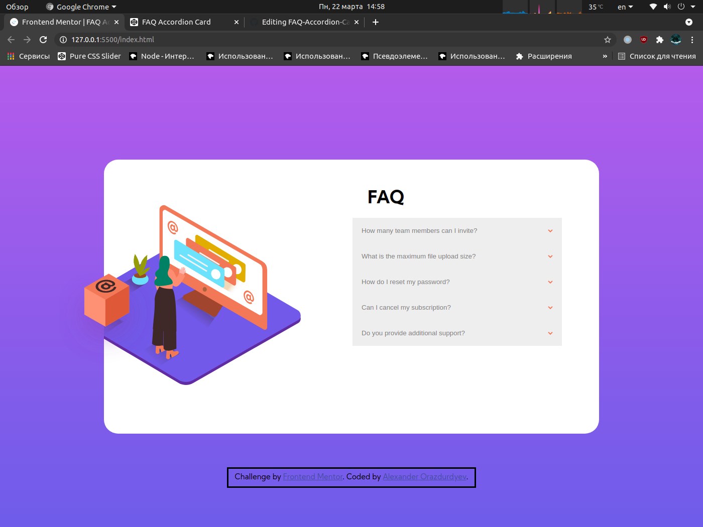

# FAQ-Accordion-Card-
Challenge by Frontend Mentor

## Table of contents
- [Overview](#overview)
  - [Screenshot](#screenshot)
  - [Links](#links)
- [My process](#my-process)
  - [Built with](#built-with)
  - [What I learned](#what-i-learned)
  - [Continued development](#continued-development)
  - [Useful resources](#useful-resources)
- [Author](#author)

## Overview

I finished work on FAQ Accordion Card

### Screenshot


### Links
- Solution URL: [GitHub](https://github.com/IcEWaRRiOr01/FAQ-Accordion-Card-)
- Live Site URL: [link](https://codepen.io/icewarrior01/full/QWdLdrK)

## My Process

### Built with

- Semantic HTML5 markup
- CSS custom properties

### What I learned

I learned how to make accordion card with HTML, CSS and JS.

### Continued development

I need to learn about "Mobile-first workflow" and do it...

### Useful resources

- [Habr](https://habr.com/) - it helped me for centering the blocks reason
- [htmlbook](https://htmlbook.ru/) - it helped me for hiding part of an element off the edge reason with ```overflow: hidden```
- [colorzilla](https://www.colorzilla.com/gradient-editor/) - it helped me for making gradient reason

## Author

- Website - [CodePen](https://codepen.io/icewarrior01/full/QWdLdrK)
- Frontend Mentor - [@IcEWaRRiOr01](https://www.frontendmentor.io/profile/IcEWaRRiOr01)
